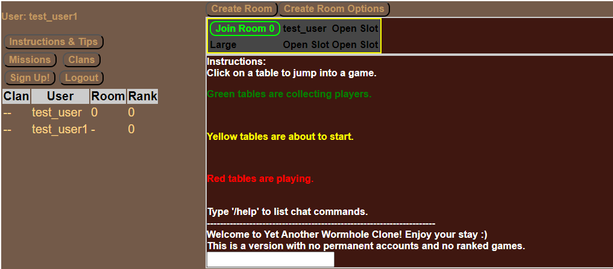
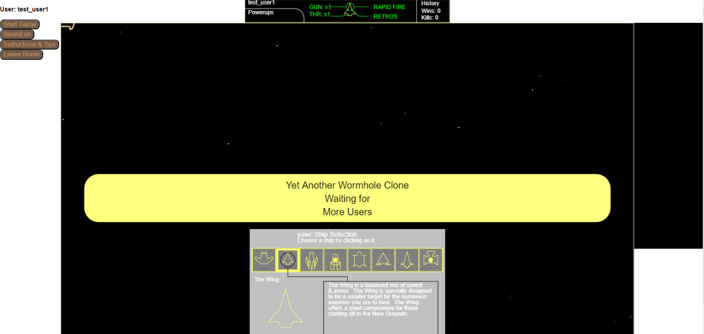
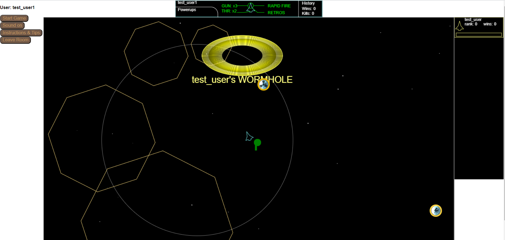

# Yet Another Wormhole Clone (yawc)

This project aims to re-create the CenterFleet Game Wormhole using Javascript for in-browser gameplay.

The code is based on the Java repo:
https://bitbucket.org/harenbergsd/wormhole-redux/commits/

The client is written in Javascript and the server is a Deno server side application written in Typescript.

Live experimental server at: https://yetanotherwormholeclone.com

Below are screenshots from the game

